

## A timed memory game built using javascript. 

[Visit the site here.](https://yemsala.github.io/Rainbow-Shapes-Memory-Game/)

<h2 align-items="center">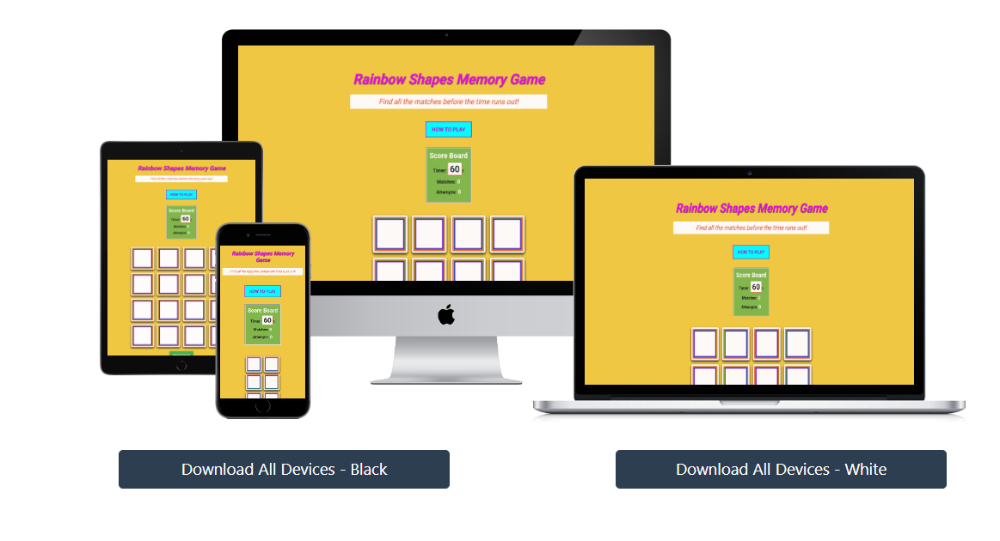</h2>

## Table of Contents

- [Introduction](#introduction)
- [Project Goals](#project-goals)
- [Features](#features)
- [User Experience](#user-experience)
    - [User Stories](#user-stories)
    - [Design](#design)
        - Color Scheme
        - Typography
        - Imagery
        - Wireframes
- [Technologies Used](#technologies-used)
- [Testing](#testing)
- [Deployment](#deployment)
- [Credits](#credits)
- [Contact](#contact)

## Introduction

Welcome to the Rainbow Shapes Memory Game, built for my Milestone 2 project!  
Dive into a world of vibrant colors and playful shapes with this Rainbow Shapes Memory Game!

### Project Goals

This timed web-based game, built using HTML5/CSS & Javascript, challenges your memory and reflexes as you match pairs of colorful geometric shapes against the clock. 
You can beat your score by getting all the matches with fewer attempts and with more time left on the clock.

This game is perfect for players of all ages to help build and maintain memory muscles and has the following features:

- A visually appealing interface with smooth animations
- 16 cards featuring 8 unique rainbow-colored shapes
- A 60-second countdown timer to add urgency
- Real-time tracking of matches and attempts
- Easy-to-understand instructions for new players
- A responsive design that works on desktop and mobile devices

### User Stories

    ✅ - successfuly implemented

    ❌ - yet to be implemented

✅ 1. As a player, I want to see a visually appealing game board, so that I'm immediately engaged with the game.

✅ 2. As a new player, I want to access game instructions easily, so that I can quickly understand how to play the game.

✅3. As a player, I want to the timer to start only when I begin to play the game, so that I have control over when the timer begins.

✅ 4. As a player, I want to see a timer counting down, so that I know how much time I have left to complete the game.

✅ 5. As a player, I want to see my current number of matches and attempts, so that I can track my progress throughout the game.

✅ 6. As a player, I want cards to easily know when I have successfully made a match or not, so that I can enjoy a satisfying interactive experience.

✅ 7. As a player, I want to receive a congratulatory message when I successfully match all cards before the timer runs out, so that I feel a sense of achievement.

✅ 8. As a player, I want to know when the game is over if I don't match all cards within the time limit, so that I understand why the game ended.

✅ 9. As a player, I want the option to play again after the game ends, so that I can try to improve my performance or enjoy the game multiple times.

✅ 10. As a player, I want the option to reset the game, so that I can start over at any time if I choose.

✅ 11. As a player, I want the game to be responsive and playable on different devices, so that I can enjoy it on my desktop, tablet or mobile.

❌ 12. As a player, I want to be able to save my scores so I can try to beat them later

❌ 13. As a player, I want to be able to play easy and harder levels so I can challenge my memory further

### Project Goals

1. Create an accessible and visually appealing memory game using HTML, CSS and JavaScript.
2. Implement core game mechanics including card flipping, matching and timer functionality.
3. Develop a responsive design for seamless play across various devices and screen sizes.
4. Display clear instructions and real-time feedback to enhance user experience.
5. Promote cognitive skills such as memory, concentration and quick decision-making.
6. Provide an engaging, replayable experience that encourages users to improve their performance.

## Features

### Existing Features

1. Cards are shuffled and placed randomly at the start of each game.

2. A gameboard displaying 16 cards face down. You can flip over two cards at a time by clicking on them.

3. If the two flipped cards don't match, they flip back over.

4. When you find a matching pair, the cards stay face-up and can't be clicked again.

5. Your attempt counter increments with every two cards flipped.

6. Your score increments each time you find a match.

7. You can start a new game or reset the current one. Cards can't be flipped until the game starts.

8. You have 60 seconds to find all the matches.

9. The game tells you if you've won or if you should try again.

### Post MVP Features

10. You can select from Easy/Intermediate/Difficult options and vary the game challenge based on selection.
12. You can register your name at the start and save your scores to be displayed. You can then continue to try to beat your earlier scores by playing new games.
13. Integrate a leaderboard so users can see previous users' scores and try to beat them.
14. Feedback mechanism for users to submit feedback and suggestions for improvements.

## User Experience

### User Stories

#### User Goals
- Access and play the game easily on various devices.
- Have fun playing an interactive memory game.
- Experience smooth and responsive gameplay.
- Receive immediate feedback on game performance.
- Replay the game multiple times without loss of interest.

#### First Time Visitor Goals
1. I want to quickly understand the game's concept and rules.
2. I want to navigate the game interface easily.
3. I want to successfully complete a game to understand the gameplay flow.

#### Returning Visitor Goals
1. I want to improve on my previous performance (score/attempts/completion time).
2. I want to experience consistent performance across different devices.
3. I want to explore any new features or updates since my last visit.

#### Frequent Visitor Goals
1. I want to beat and save my personal best records.
2. I want to enjoy the game as a regular brain-training exercise.
3. I want to suggest improvements or new features based on my extensive experience.

### Design

#### Color Palette

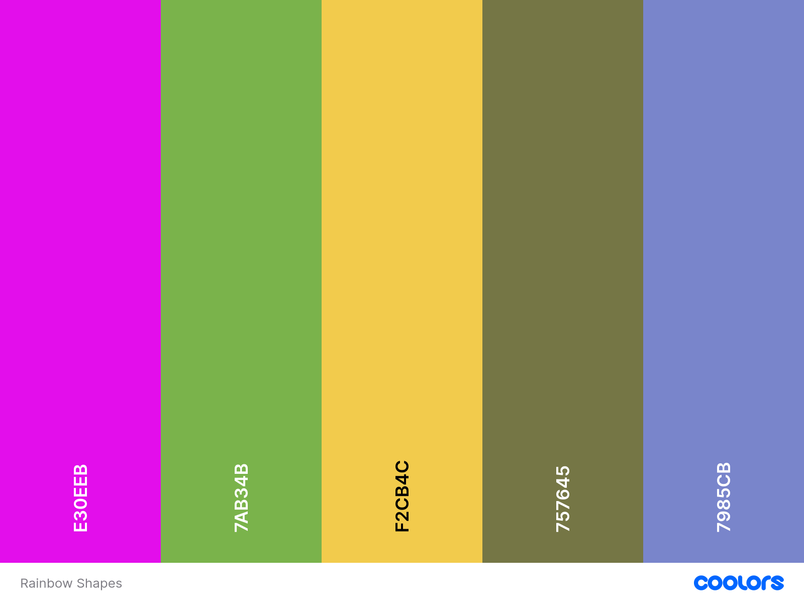
The website uses a palette of colours based around the page title/logo and the overall background to keep a clear focus on the game elements and ensure they stand out well enough to engage the user's attention. The colour palette was created using the [Coolors website](https://coolors.co/) .

### Typography

The typography used in this game aims to be easily readable, visually appealing and supportive of the overall game aesthetics without distracting from the gameplay. 

- Font Family
    - The game primarily uses the 'Roboto' font, a clean and modern sans-serif typeface.
    - A fallback to generic sans-serif fonts is provided for better cross-platform compatibility. 

- Font Sizes

    - The main title uses a large font size (2.5rem or about 40px) for prominence.
    - Game information text (timer, matches, attempts) uses medium sizes.
    - The timer digits are emphasized with a larger size (2em or about 32px) for quick readability.
    - Button text and general content use a standard size (16px) for comfortable reading.

- Font Weights
 
    - A mix of font weights is used to differentiate between various text elements. Bold weights are used for headings and important information, while regular weight (400) is used for body text.
    - The game title use a bold weight (700) to stand out.
    - The timer digits use a bold weight to draw attention.

- Text Alignment

    - The game title and main headings are center-aligned for a balanced appearance.
    - Game information and instructions are typically left-aligned for easy scanning.
    - Button text is center-aligned within the buttons.

- Line Spacing and Letter Spacing

     - Generous line spacing and appropriate letter spacing ensure that the text is not cramped, improving overall legibility.

##### Imagery

The Rainbow Shapes Memory Game features bright and vibrant imagery that is designed to bring the game to life for players of all ages and reinforces its cheerful, colorful theme:

1. Rainbow Card Shapes: 
   - Each card features a geometric shape filled with a rainbow gradient.
   - The shapes include circles, squares, triangles, stars, hearts, diamonds, hexagons and pentagons.
   - These rainbow-filled shapes are the core visual elements, embodying the game's title and theme.
   - The use of rainbow colors in every shape creates a cohesive and visually striking set of cards to match.

2. Card Back Design:
   - When face-down, the cards display a uniform design with rainbow colored borders.
   - This design choice hints at the rainbow theme without revealing the shapes.

3. Background:
   - The game board sits on a soft, pastel-colored background.
   - This background complements the vibrant card designs without overwhelming them.

4. User Interface Elements:
   - Buttons and information displays use colors that harmonize with the rainbow theme.
   - Icons and other UI elements are minimised and designed to be visually consistent with the overall aesthetic.

I initially considered using a rainbow background for the whole page, however decided this would be overpowering and perhaps take away the focus of the site purpose itslef, the game.

So I decided that the rainbow effect would be best utilised within the card images themselves, reinforcing the game's theme and creating a unified experience. This subtle approach promotes focus and aids in memory association, as players connect colors and shapes.

### Wireframes

Wireframes were created for the game in wide and narrow views, using Balsamiq. These were used as a guide for development of the site layout and structure.

- 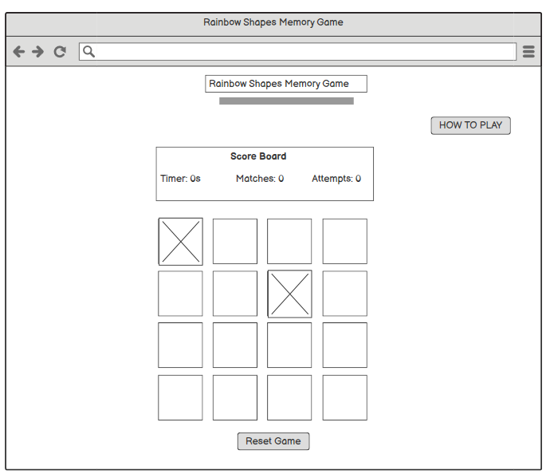
- 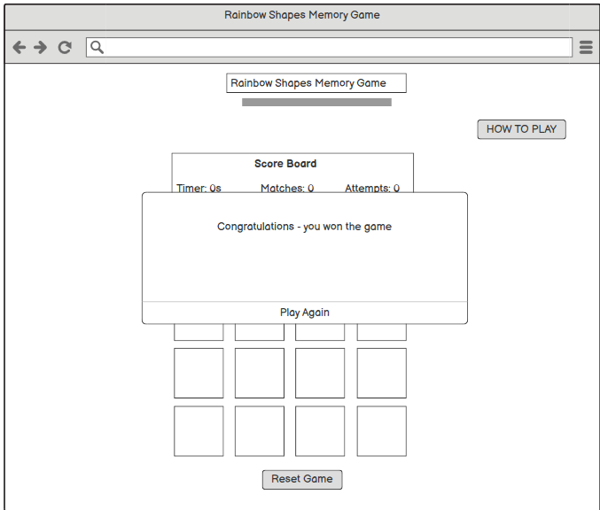
- 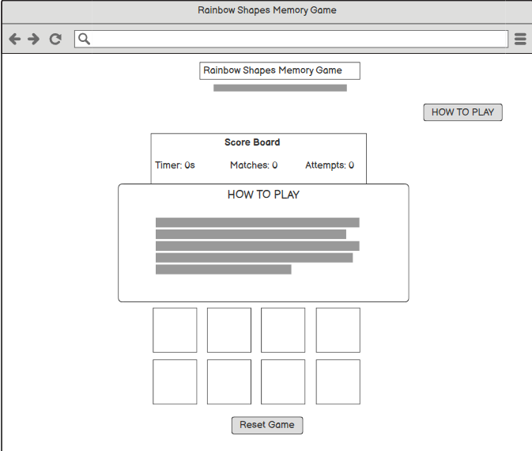
- 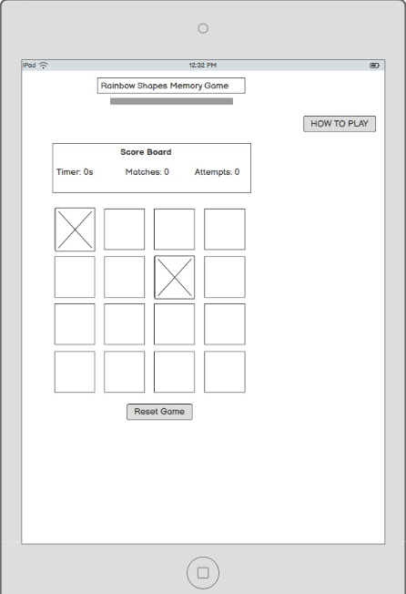
- 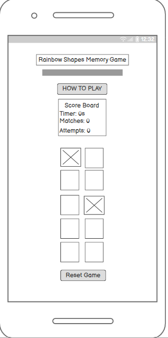
- 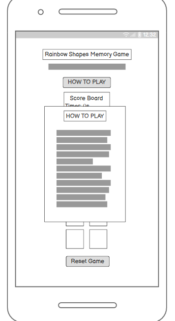

## Technologies Used

### Languages

- **HTML5**: For structuring the content on the website.
- **CSS**: For styling and layout.
- **Javascript**: Used to help with styling and responsiveness.

### Frameworks, Libraries & Programs Used

- **Balsamiq**: Used to create wireframes during project planning
- [**Bootstrap 5**](https://getbootstrap.com/docs/5.3/getting-started/introduction/): For responsive design and additional styling components.
- [**Google Fonts**](https://fonts.google.com/): Google fonts was used to import the 'Maitree, Quicksand & Roboto' fonts into the style.css file.
- **Git & GitHub Pages**: Used for version control by utilizing the Gitpod terminal to commit to Git and Push to GitHub. Also to securely store the code and to host and deploy the live project.
- **GitPod**: Used as a cloud-based IDE for development
- **Chrome Developer Tools**: Used for testing and troublshooting code

# Testing

## Testing User Stories

### First Time Visitor Goals
#### 1. Quickly understand the game's concept and rules

The site achieves this goal through:

- Clear Instructions: A clear subtitle at the top of the page with an easily accessible "How to play" button, which opens a modal with concise, step-by-step instructions.
- Visual Cues: The game board's layout with face-down cards intuitively suggests a memory matching game.

    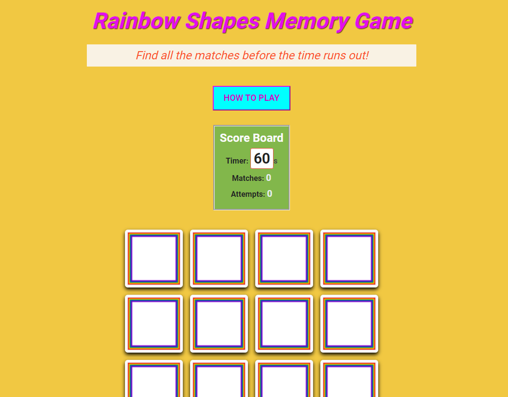
    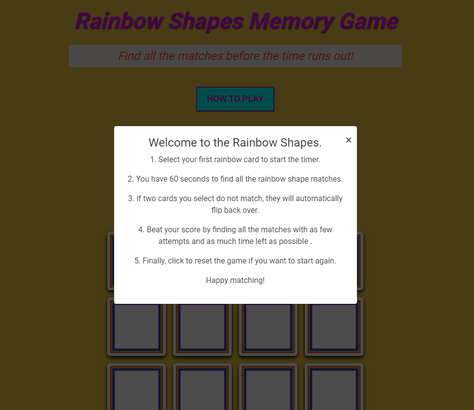

#### 2. Navigate the game interface easily

The site facilitates easy navigation by:

- Simple Layout: The game board, timer and score information are prominently displayed
- Responsive Design: The game adapts to different screen sizes, ensuring easy interaction on various devices.
- Clear Buttons: The "Reset Game" and "How to play" buttons are distinctly visible and labeled.

    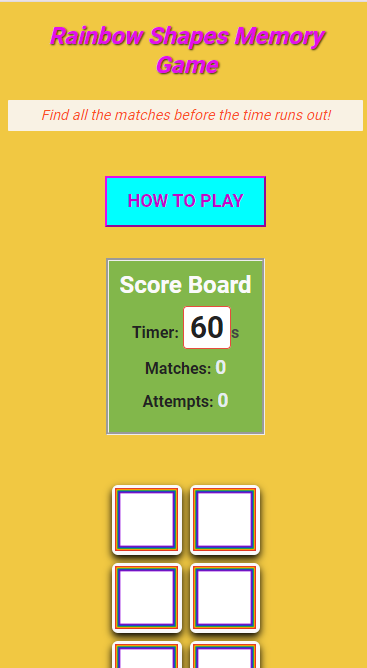
    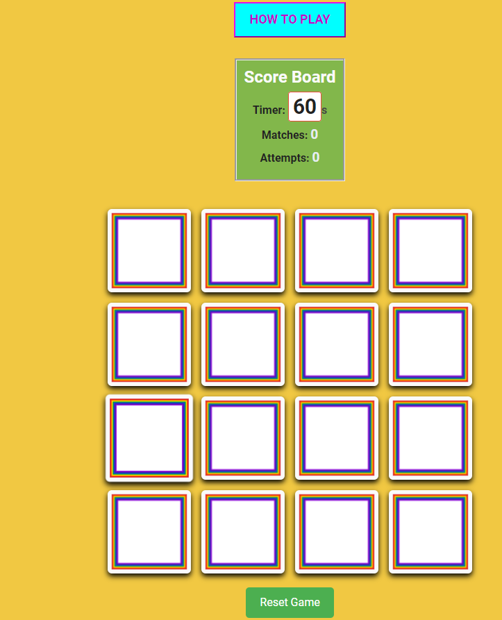

#### 3. Successfully complete a game to understand the gameplay flow

The site supports this goal through:

- Visual Feedback: Matched pairs remain face-up, providing a clear sense of progress.
- Real-time Updates: The score and timer constantly update, keeping the player informed of their progress and remaining time.
- End-game Feedback: Upon completion (win or lose), a modal appears with the game results, clearly marking the end of a round.
- Replay Option: The option to play again is immediately presented, encouraging players to try again.

    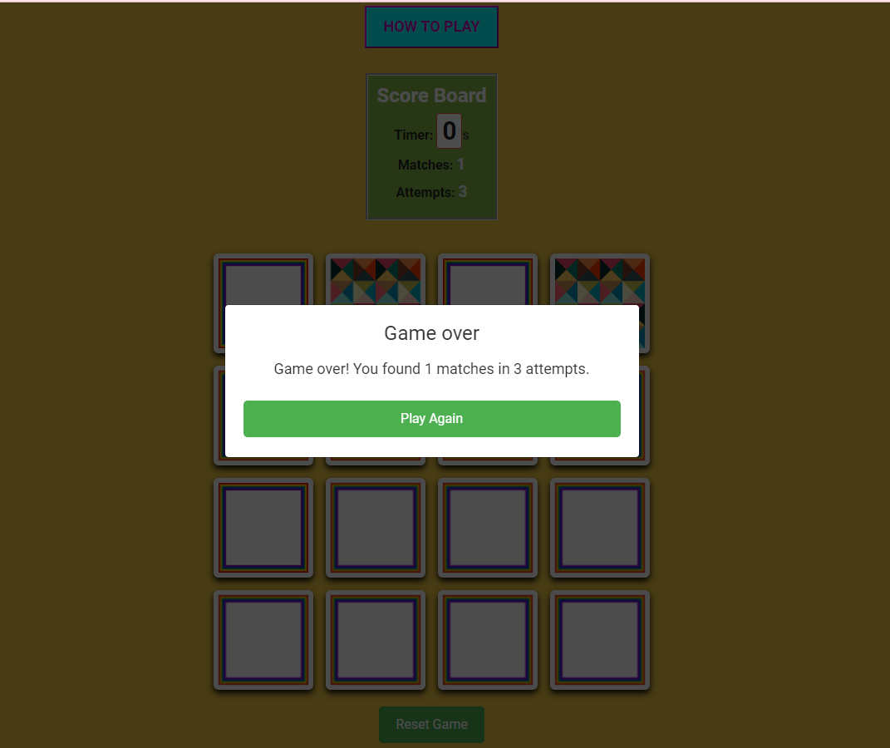
    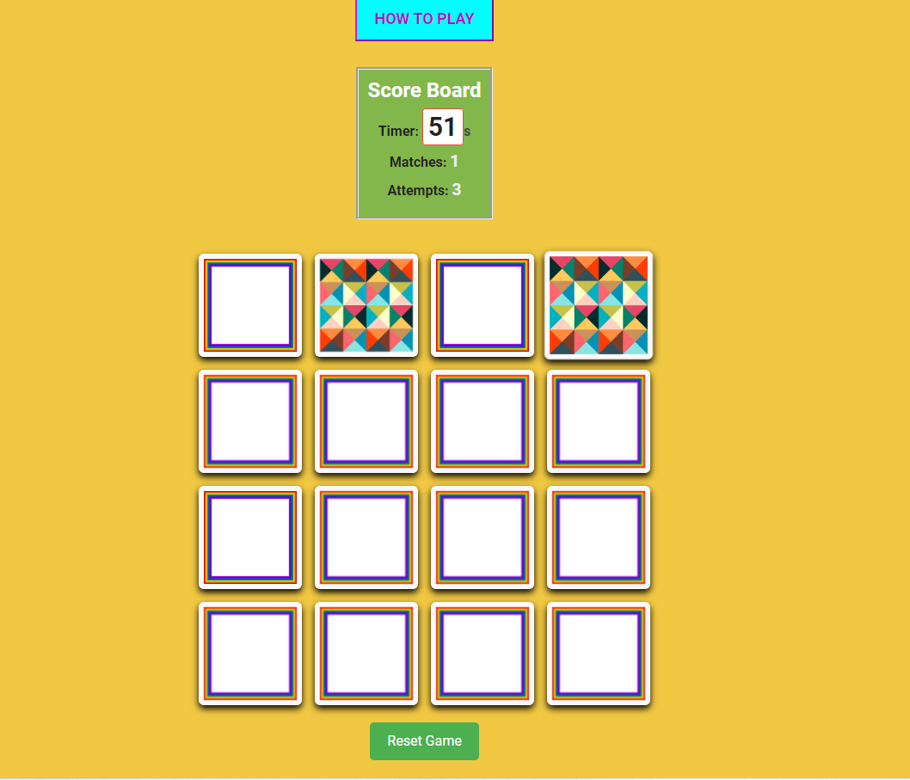

### Returning Visitor Goals

#### 1. Improve on previous performance (score/attempts/completion time)

- Real-time Feedback: The game displays current score, attempts and remaining time, allowing players to gauge their performance against previous sessions.
- End-game Summary: After each game, a results modal shows the final score and time.

#### 2. Experience consistent performance across different devices

- Responsive Design: The game's layout adapts seamlessly to different screen sizes, maintaining playability on both desktop and mobile devices.

    | Desktop       | Tablet        | Mobile |
    |:-------------:|:-------------:|:-----:|
    | 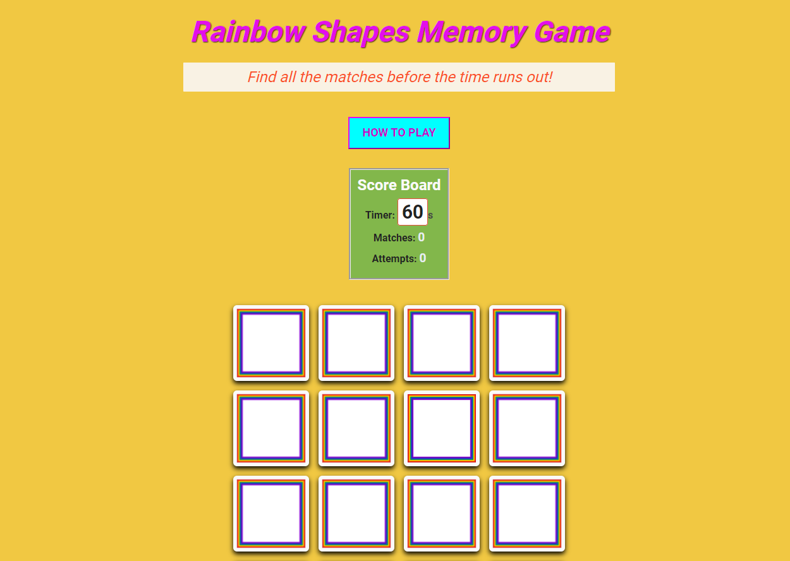    | 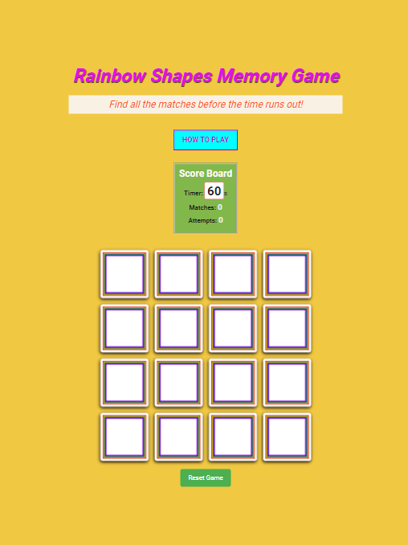| 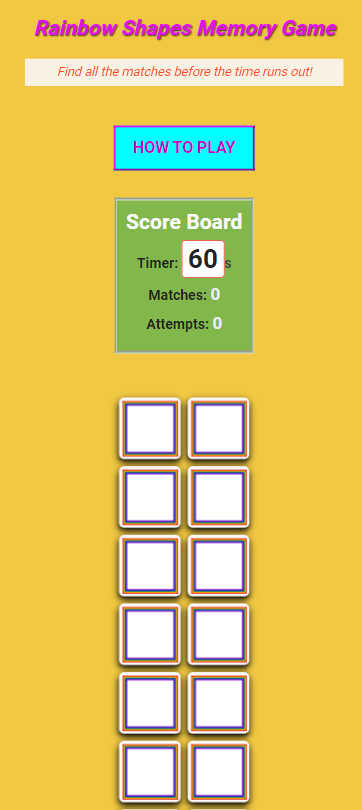 |

#### 3. Explore new features or updates since last visit

❌ - yet to be implemented

- Version Information: The game's footer or about section could include the current version number or last update date, alerting returning players to potential changes.
- Change Log: A dedicated section (accessible via a button or link) could list recent updates and new features, helping returning players discover what's new.

### Frequent Visitor Goals

#### 2. Enjoy the game as a regular brain-training exercise

- Randomized Card Placement: Each new game shuffles the card positions, ensuring a fresh challenge every time.
- Timed Gameplay: The 60-second countdown adds pressure, training quick thinking and decision-making alongside memory.

    
### Overall Performance

#### Chrome DevTools Audit Report

The Google Page-speed Services was used to assess the accessibility of the project to ensure the site met expected accessible standards on desktop and mobile.

 
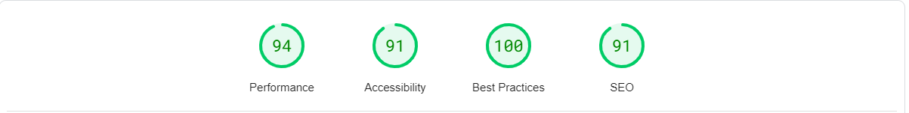 

### Browser Testing

- The site has been tested on Google Chrome, Safari, Microsoft Edge and Firefox browsers.
- The website was tested on my iPhone 13 mobile. All other responsive testing was completed online.
- Testing was done to ensure that all intended functionality is working correctly and with good performance
- Friends and family members reviewed the game and documentation to point out any bugs and/or user experience issues.

### Code Validation

Each page of the project was thoroughly checked for syntax errors using the W3C Markup Validator and W3C CSS Validator Services. The validation results and corresponding screenshots are presented in the table below.

|  Page        | Result           | Notes  |
| ------------- |:-------------:| -----:|
| Home |   |  No errors |
| About Netball |     | No errors   |
| Playing Netball |    |  No errors  |
| Contact |    | No errors  |
| CSS |    | Passed (initial parsing error resolved)  |

### Bug fixes

1. I notice that it would be more helpful for the scoreboard to be 'sticky' on narrow/mobile view so that the timer is still visible for a better user experience. I am doing some work to adjust the code so that this is possible on mobile view when the user scrolls down the page and they know how much time they have left.

| Desktop       | Mobile           |
| ------------- |:-------------:|
|      |   |

3. On initial validation of my CSS code, I kept getting a parsing error for line 367, where I had an element nested inside another for the videos on the Playing Netball page and the validator didn't like that and therefore kept throwing up this error. 
To solve this issue, I removed, the *.col-3* element out of the *.tutorial-videos* element and although I was worried it might affect the output, it didn't. After doing this, I was able to pass the CSS code validation (see relevent screenshot in the *Code Validation* section above).

## Deployment

### Github Pages

1. Access Your GitHub Repository
    - Log into GitHub and navigate to the repository you're working with.
    
2. Find the "Settings" Option
    - Within your repository's page (not the top of the GitHub site), find and click the "Settings" button in the menu bar.

3. Navigate to GitHub Pages Settings
    - On the Settings page, scroll down until you find the "GitHub Pages" section.

4. Select the Source for Your Site
    - In the "Source" section, use the dropdown menu (initially set to "None") and select "Main Branch" (or "Master Branch" if that's what your repository uses).

5. Wait for Page Refresh
    - The page will refresh automatically after you select the branch.

6. Scroll back down through the page to locate the now published site [link](https://yemsala.github.io/netball-fanatic/index.html)  in the "GitHub Pages" section.

### Forking the GitHub Reository

By forking the GitHub Repository we make a copy of the original repository on our GitHub account to view and/or make changes without affecting the original repository by using the following steps...

1. Log in to GitHub and locate the [GitHub Repository](https://github.com)
2. At the top of the Repository (not top of page) just above the "Settings" Button on the menu, locate the "Fork" Button.
You should now have a copy of the original repository in your GitHub account.

### Making a Local Clone

1. Log in to GitHub and locate the [GitHub Repository](https://github.com)
2. Under the repository name, click "Clone or download".
3. To clone the repository using HTTPS, under "Clone with HTTPS", copy the link.
4. Open Git Bash
5. Change the current working directory to the location where you want the cloned directory to be made.
6. Type git clone, and then paste the URL you copied in Step 3.

$ git clone https://github.com/YemsAla/netball-fanatic.git

7. Press Enter. Your local clone will be created.

$ git clone https://github.com/YemsAla/netball-fanatic.git

> Cloning into `CI-Clone`...
> remote: Counting objects: 10, done.
> remote: Compressing objects: 100% (8/8), done.
> remove: Total 10 (delta 1), reused 10 (delta 1)
> Unpacking objects: 100% (10/10), done.

Click [Here](https://docs.github.com/en/repositories/creating-and-managing-repositories/cloning-a-repository#cloning-a-repository-to-github-desktop) to retrieve pictures for some of the buttons and more detailed explanations of the above process.

## Credits

### Acknowledgements

- Cohort Leader Rachel Furlong for her continued support.
- Tutor support at Code Institute for their support.
- Vernell C | [https://github.com/VCGithubCode]
    - Fellow student who provided invaluable mentorship and support during each stage of the project, especially in debugging.

### References

- Source: YouTube | 
- Source: W3Schools | [https://www.w3schools.com/]
    - Used for HTML & CSS code 
- Source: Chat GPT
    - For content & research
? https://websitemockupgenerator.com/
- Picture References
    - Source: Cynon Netball Club | [https://connectrct.org.uk/activity/cynon-back-to-netball-club]
    - Source: Gilbert Netball | [https://www.gilbert-netball.com/blogs/netball/netball-101]
    - Source: Linked-In |The Pivot Newsletter | [https://www.linkedin.com/pulse/pivot-jacob-william-gooden/]
    - Source: England Netball | [https://www.linkedin.com/pulse/pivot-jacob-william-gooden/]
    - Source: Netball Australia |[https://netball.com.au/news/immense-sense-achievement-and-pride-teede-recalls-71-world-netball-tournament]
    - Source: World Netball | [https://netball.sport/game/facilities-and-equipment/]
    - Source: Play Netball | [https://www.play-netball.co.uk/rules-and-regulations/]
- Videos
    - Source: intosport.com | [https://www.youtube.com/watch?v=TvfGjq7cWfA]
    - Source: Netball Australia| [https://www.youtube.com/watch?v=N_kiYeeYvkU&t=12s]
    - Source: Netball Australia| [https://www.youtube.com/watch?v=lzPJPCg5SCg]
    - Source: Netball Australia| [https://www.youtube.com/watch?v=rtnDm52t_eM&list=PLgCNJssaP1-xN6wILskPThBNxXFrNX368&index=5] 

## Contact

For any inquiries or feedback, please contact us via the contact form on the website or reach out on our social media channels.

Thank you for visiting Netball Fanatix!

---

